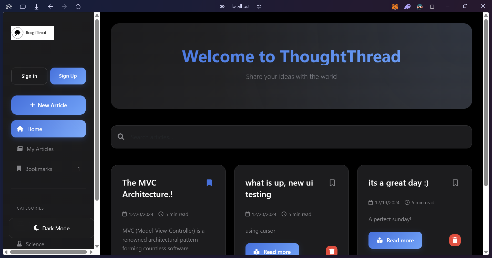

# ThoughtThread

A modern blogging platform, built with Node.js, Express, and MongoDB.



## Features

- 🎨 Modern, Apple-inspired UI/UX design
- 📝 Markdown support for article writing
- 🌓 Dark mode with system preference sync
- 🔖 Article bookmarking functionality
- 📱 Responsive design for all devices
- 🔍 Real-time search functionality
- 📂 Category-based article organization
- 🚀 Auto-saving drafts
- 👤 User authentication
- 📊 Rich text editor with toolbar

## Tech Stack

- **Frontend**: EJS, Bootstrap 5, Custom CSS
- **Backend**: Node.js, Express.js
- **Database**: MongoDB
- **Authentication**: bcrypt
- **Other**: Marked (Markdown parsing), DOMPurify (Security)

## Prerequisites

- Node.js (v14 or higher)
- MongoDB
- npm or yarn

## Quick Start

1. Clone the repository:
   ```bash
   git clone https://github.com/yourusername/thoughtthread.git
   cd thoughtthread
   ```

2. Install dependencies:
   ```bash
   npm run setup
   ```

3. Create a `.env` file in the root directory:
   ```env
   MONGODB_URI=your_mongodb_connection_string
   SESSION_SECRET=your_session_secret
   PORT=5000
   ```

4. Start the development server:
   ```bash
   npm run dev
   ```

The application will be available at `http://localhost:5000`

## Project Structure

```
thoughtthread/
├── models/          # Database models
├── public/          # Static files
│   ├── images/
│   └── styles/
├── routes/          # Route handlers
├── views/           # EJS templates
│   ├── articles/
│   └── partials/
├── server.js        # Application entry point
├── package.json
└── README.md
```

## Available Scripts

- `npm run dev` - Start development server with hot reload
- `npm start` - Start production server
- `npm run setup` - Install dependencies and setup project

## Contributing

1. Fork the repository
2. Create your feature branch (`git checkout -b feature/amazing-feature`)
3. Commit your changes (`git commit -m 'Add some amazing feature'`)
4. Push to the branch (`git push origin feature/amazing-feature`)
5. Open a Pull Request

## License

This project is licensed under the MIT License - see the [LICENSE](LICENSE) file for details.

## Acknowledgments

- Design inspired by Apple's modern UI/UX principles
- Icons from Font Awesome
- Markdown support powered by Marked

## Screenshots

### Home Page


### Article Editor


### Article View


## Contact

Your Name - [@yourusername](https://twitter.com/yourusername)

Project Link: [https://github.com/yourusername/thoughtthread](https://github.com/yourusername/thoughtthread)
